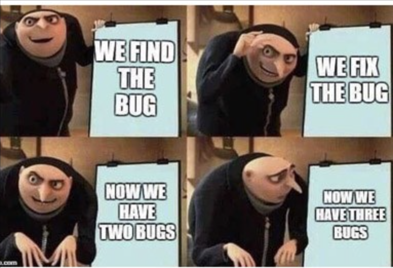

## Where it all began.
Growing up my cousin who I looked up to for everything had his hobbies of fixing computers and programming. As a kid I would watch him play on his comptuer and learn how to program in various languages. As I got older and understood what programming was, I was able to join robotics where I would be able to learn how to program. The programming language used in robotics was C or C++. I had a hard time understanding the logic used to program the robot. I felt defeated and gave up to focus on the design and building aspect of robotics. I loved the engineering design process so much that I wanted to major in Mechanical Engineering in college. 

## What changed?
My second semester at Kapiolani Community College I began to question if I really wanted to become a Mechanical Engineer. I was at a lost of what I would want to major in. One of the ICS tutors at the STEM center asked if I ever looked into computer science as a possible major choice. There was a part of me that still wanted to learn how to program but was scared since I had a tough experience the first time. The tutor explained to me that the teacher teaching ICS 111 was a fantastic teacher and she is passionate about teaching students to program. 

## Scared but Excited!
After taking my first computer science class I was hooked! I enjoyed learning different programming languages in the two year of taking classes at KCC. The logic for programming clicked and I was no longer afraid to learn new languages. I was scared to take a software engineering class since I have no idea what to expect. The main thing I would like to take away from this course is how to work in a team for a coding project. Expanding my knowledge of software engineering might make me question if I am in the right major again. Or it might be something I would want to learn more about on the side. 

## Any Regrets?
I have no regrets on changing my major last minute to computer science. I hope that my knowledge of software engieering continues to grow. Web devlopment and design are intrest I hope to learn more about in this software engieering class. I am excited to learn more about Javascript to implement it in my outside projects. 
