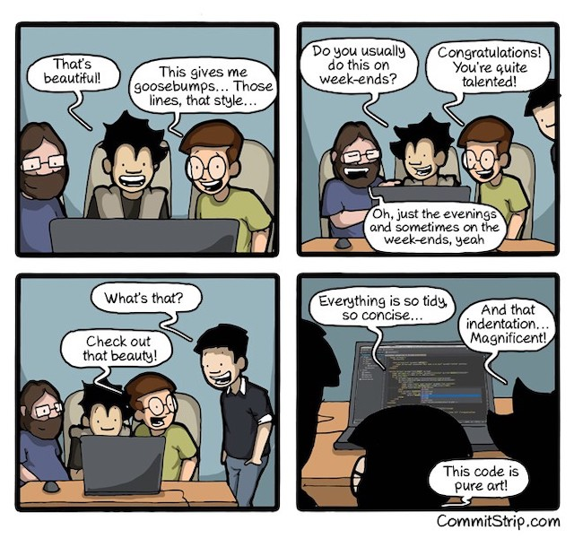

## Coding Guidelines 
A seasoned programmer knows how important it is to have their code meet the given coding standard. Coding standards are important when you begin to work in a group and every person has their own style of programming. The coding standard can maintain a consitant flow in the code for everyone to understand. Some examples of coding standards given by geeksforgeeks goes as follows, limited use of globals, standard headers for different modules, naming conventions for local variables, well documented, etc. Using coding standards can improve the development time and decrease the amount of bugs in the code. Beginner programmers first learn about the importance of comments in code, then it develops into other areas of coding styles. 

## My First Experience 
The first programming class I took used jGrasp as our development environment to program in java. We used the checkstyle tool to determine if our code followed the set foramtting rules our teacher set up. For each assignments we had to make sure our code passed the checkstyle before turning it in. Sometimes we were lucky to have only a few errors, however, there would be times where we had a lot of checkstyle errors and it would take a long time to fix them. 

 [Source](https://www.geeksforgeeks.org/coding-standards-and-guidelines/)
 
## Learning from the start 
 When I am asked to judge the VEx IQ events for elementary- middle school, I am  incharge of asking the students about their code. As I look over their code I am looking for two important details in their code. One being that they are able to explain to me what their code does and if I wanted to change something specific, where in the code would they make that change. The other thing I look at is how well they comment their code. Having comments in their code is a great since their teammates are able to know what the code does and if they need to fix something, they know exactly where to look. It is also good for the judges who do not understand the programming language, they are able to look at the comments and get a understanding on what the students program does in competiton. Since learning more about coding standards, I am able to give students more advice on their programming style so they have some practice for if and when they go into the programming profession. 
