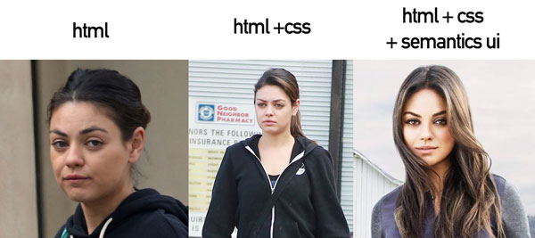

 

## Lets Make a Website!
Small businesses or companies use website builders such as Wix, Wordpress, or Square Space to build their website. However, these sites require a monthly fee to create and build your website. What if I told you there was a way you could build your website without paying monthly fees? Using an UI framework can help you create fancy websites quickly using human friendly HTML. HTML (Hypertext Markup Language) is the language to create webpages and CSS (Cascading Style Sheet) is a style sheet used to format the layout of the webpage. HTML and CSS can get you a basic website up and running, but what if you wanna make your website fancy and more appealing to look at? Semantic UI is a mondern front-end development framework that has re-usable UI components to customize your site. Semantic UI is like the makeup to make to make your site beautiful and easy on the eyes. 

## What difference does it make? 
Our first assignment we had to do using HTML and CSS got me excited to learn how to build a website without using a website builder. When the page loaded with the code I wrote I was not impressed with the format of the webpage. It was very bland and it would be a website I would close immediately if clicked on. Once we learned how to apply Semantic UI to our webpage, I was more pleased on how the website turned out. I was able to customize the website a bit more than what I was limited to in HTML and CSS. Semantic UI is like the makeup for HTML and CSS, it is used to make it look beautiful. Semantic UI has great documentation on each components and how to use them. At first, learning how to use Semantic was difficult but the more I used it and looked at examples, it got much easier. The best part about the framework is that we are able to use it to re-create other websites we find fancy. It might not be an exact replica of the original but it looks just the same. 

## To Each their Own
In the end, many people have their own opinion on Semantic UI. I really enjoyed learning how to implement it in my code to make a website better looking. Some people perfer a simple website layout, but I find that websites that have more of a fancy touch to them attact more viewers. I hope to continue learning more about Semantic UI to use for my current project in creating a website for my job. 

