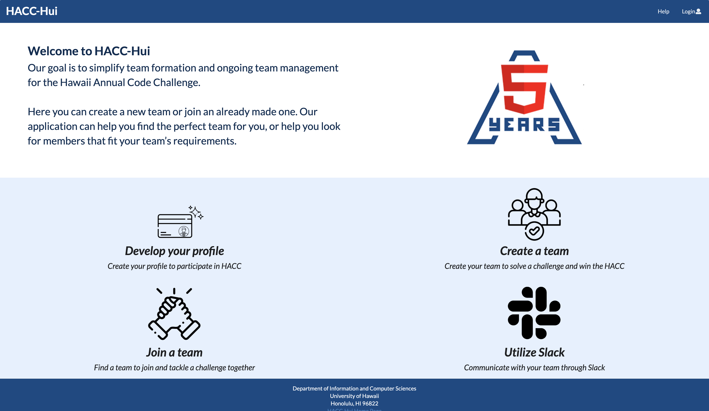

<h2> Hawaii Annual Code Challenge </h2>
[Hawaii Annual Code Challenge](https://hacc.hawaii.gov/) (HACC) is a unique hackathon that stregthens the pipeline of the IT workforce in the state of Hawaii. At the HACC kick off, participants form teams, select a challege that interests them and work together to create an innovative web application. In the past, the informal team formations lead to high failure rate with participants joining the wrong teams and overall having a bad experience. The students taking ICS 414 (Software Engineering II) spent eight weeks building a Meteor application intergrated with Slack to create [HACC Hui](https://hacc-hui.github.io/) a user friendly web application to improve the team formation process at the event. This project was a success at the 2020 HACC Kickoff on October 24 making the team formation a better experience for all participants. 

<h2> LevelUpTeamA </h2>
At the beginning of the semester our class was randomly split into teams of four or five students. Each team would work on the milestones created. At the end of each milestone our professor would pick the best implementation and we would all use that implementation onwards. I was on LevelUpTeamA with Nadine Alcantara, Angeli Amascual, Newton Ransfer, Justin Wong. We communicated through Discord to set up team meetings to go over what everyone's task were for each milestone. Before assigning the issues, we added our class/work schedules in our group chat so we could find the days that we could meet and discuss our game plan for this project. We ceated a project board for each milestone and assigned ourselves to an issue to work on during the week. This was a good way to organize the tasks that needed to be completed and everyone could pick an issue they were interested to work on. 

<h2> User Stories </h2>
HACC Hui has three different types of users. The first would be the "installers" who are the software developers, "Administrators" who are the members of the program committee, and lastly "Participants" who are the HACC participants. We were provided with [User Stories](https://hacc-hui.github.io/docs/requirements/installers) that gave us an explanation of what needed to be featured on the website. Each milestone included a specific user story that we would have to implement. After completing each milestone, each group would present their solutions to the class and our professor would pick the best and implement it in the "final" repository that the whole class would use in the end.  

<h3> Milestone 1 </3>
First Header | Second Header
------------ | -------------
Content from cell 1 | Content from cell 2
Content in the first column | Content in the second column
