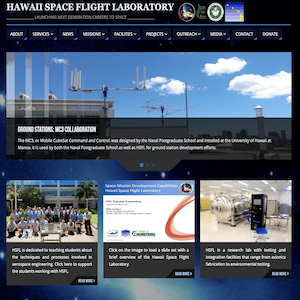
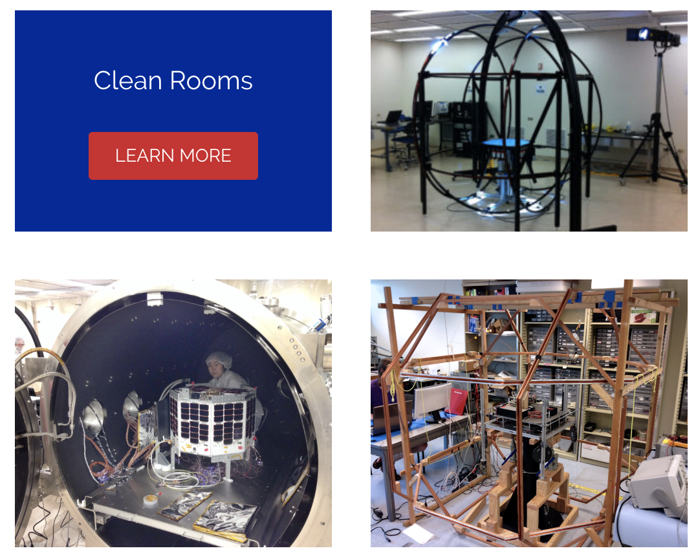
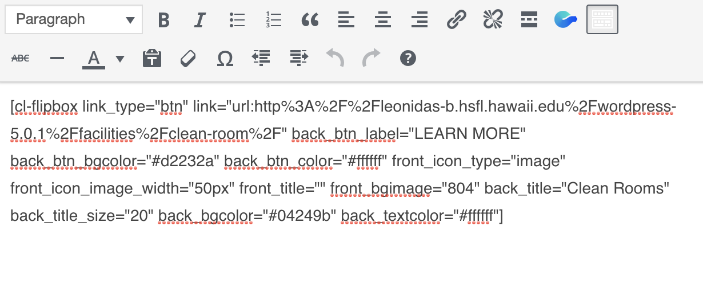

As a student assistant at Hawaii Space Grant Consortium, I was given the task to redesign and update the Hawaii Space Flight Lab website. The program I am using to design the website is called Wordpress. This was my first time using Wordpress so I had to do a lot of research prior to starting this project. 

I am using Adobe Photoshop and Illustrator to create images and banners for the different pages. This project is fairly simple since I am transferring the information from their old site and adding them to the new layout. I made an outline to plan out what the dropdown menus should have and where it directs the user when clicked. This made the designing a lot easier since I could look at my outline when assigning URLs to the buttons. 

Wordpress uses a lot of plug-ins to help build the layout of your website. One of the plug-ins that I am using is Codelights Shortcode that helps create different widgets for your page. When setting up the flipboxes it is simple and user-friendly, but once you click submit the shortcode of your input is placed in the text box. At first, I did not understand what it all meant but after analyzing it I was able to edit the code instead of going to the edit button. 

