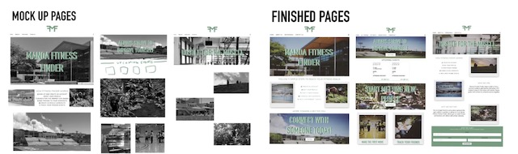

<h2> Freshman Fifteen </h2>

 The term "Freshman 15" is an expression commonly used in the college community that refers to an amount of weight gained during a student's first year at college. Students who are affected by the freshman 15 might feel insecure to go to the gym alone and thus gain more weight throughout college. The website my team developed allows students to create a profile with their fitness interests/goals, meet new people, and create or attend events. The users can see their friend's upcoming events and they can click a button to list that they are going to attend the event too. 
 
 <h2> My Role on the Team </h2>
 
 
 
 My role on the team was one of three web designers for the various pages we were going to have on our site. After our first meeting, we decided which page mockups we wanted to design and have it ready for our second meeting. I was in charge of designing the landing page, about us, and the user landing page. We decided that we wanted the navigation bar at the top to be different from a non-user and a user. I designed the landing page to give a new user to the site the most information they needed to be interested in making an account. The about page gave highlights about the site and a little more information out of our site. The user landing page was designed for the user to click a button to all the functionality to the site. Also, it would display the user's upcoming events they created. To create these mockup pages, I used an app called Procreate to add images and design it as closely as to how we wanted those pages to look like. I've learned that working in a group with different design styles can be tough at first but there is always a happy medium in the end.

<h2> Future in Web Design? </h2> 

After working on this project, web design is something I would want to pursue as my career in the future. It was fun searching for images that would make the idea of the site pop and intrigue users to use our site. I also did some research on different fitness sites to see how they market to "fitness users" in hopes for our site to do the same. My dream job would be the project manager in web design. I would want to work with the client to design their site and be able to pass the functionality on to the developer team to figure out the best way to develop the site. Although it would be best for me to do all functionality and design, I have more of an interest in making the site look appealing to the audience. For now, I will be taking the skills I learned while completing this project into my current job designing a website for work. 

Take a look at the source code for the project [here](https://github.com/manoafitnessfinder)
