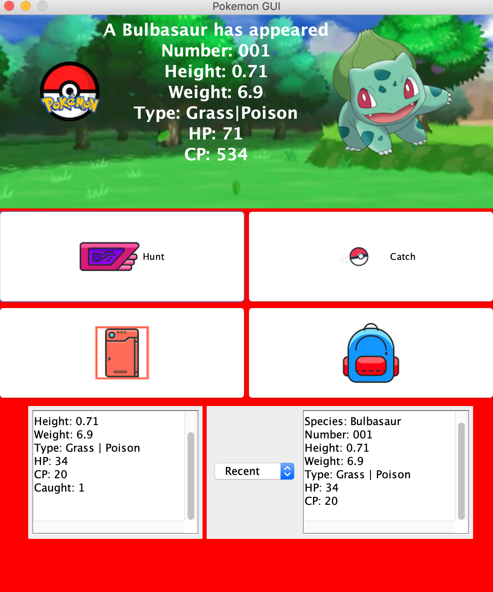

  A GUI (Graphical User Interface) is an interactive visualization system that allows the user to interact with the program. I created a Pokemon GUI for my final project in ICS 211. We combined all our assignments from the semester and created a game like program where we could hunt for pokemon and catch them and save the Pokemon to our Pokedex. I used JGrasp software to code my project in Java.
  


The user would click the hunt button and a Pokemon along with its’ information would appear to the screen. If the user clicks the catch button, the program randomly selects if the pokemon should be caught or if it escaped. If the pokemon was caught, then the user could click the backpack icon or the Pokedex icon to see which and how many pokemon they achieved.

I worked on this project by myself but got help from an ICS tutor to research how to set the background to an image instead of a solid color. After hours of searching StackOverflow and other various programming sites, we found a line of code where I implemented in my program to set the background to the forest image.
Here is the code that sets background image to custom image in JGrasp:

```js 
public class ImagePanel extends JPanel{ 
  private Image img; 
  public ImagePanel(String img){ 
    this(new ImageIcon(img).getImage()); 
  }
  public ImagePanel(Image imf){ 
    this.img = img;
    //set layout size here 
  } 
  public paintComponent(Graphics g){ 
    g.drawImage(img, 0, 0, null); 
  } 
} 
```

  
  
  
  
