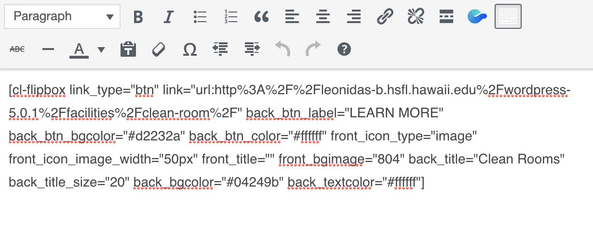

As a studnet assistant at Hawaii Space Grant Consortium, I was given the task to redesign and update the Hawaii Space Flight Lab website. The website program I am currently using is Wordpress. This was my first time using Wordpress so I had to do a lot of research prior to starting this project. 

I am using Adobe Photoshop and Illustrator to create images and banners for the different pages. This project is fairly simple since I am transfering the infromation from their old site and adding them to the new layout. I made an outline to plan out what the dropdown menus should have and where it directs the user when clicked. This made the designing a lot easier since I could look at my outline when assigning urls to the buttons. 

Wordpress uses a lot of plug-ins to help build the layout of your website. One of the plug-ins that I am using is Codelights Shortcode that helps create different widgets for your page. When setting up the flipboxes it is simple and user friendly, but once you click submit, shortcode of your input is places in the text box. At first I did not understand what it all meant but after analysing it I was able to edit the code instead of going to the edit button. 

