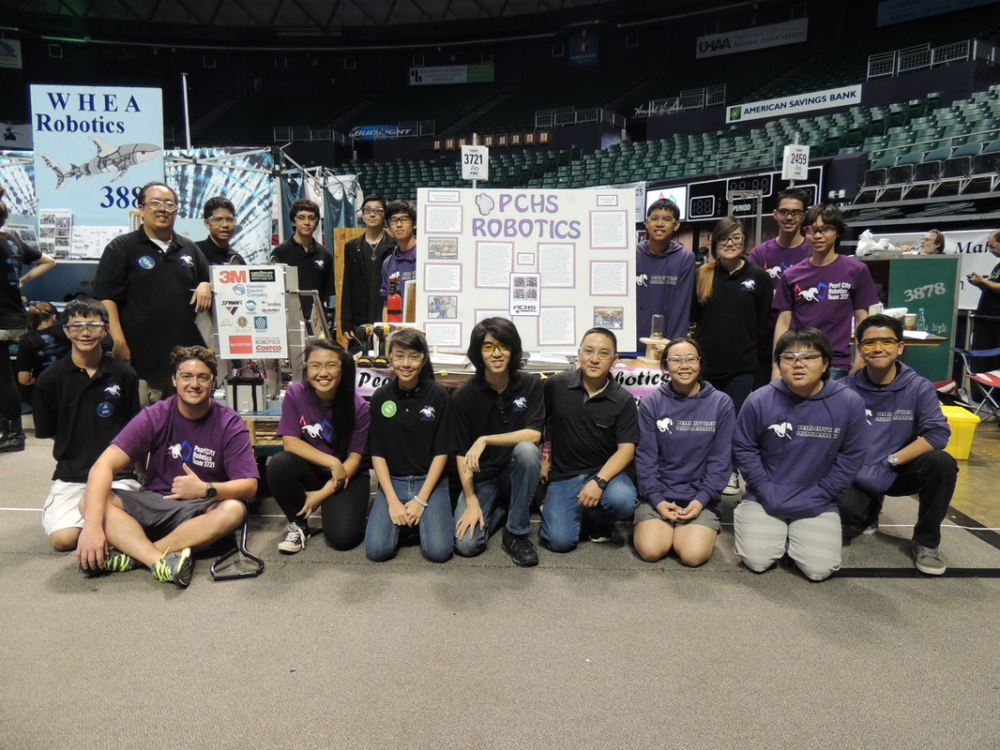
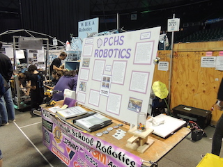
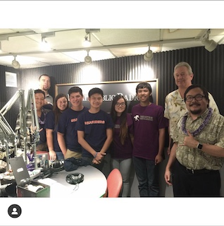

 In 2013 there was only two subdivisions teams in the robotics program, build and program. Our advisor felt that our program needed a business team for students who are interested in robotics but do not want to be on the build or program team. By 2014 the business team was created and I was assigned the lead position since I was incharge of writing the grant letters to different companies and organizating fundrasing dates for the team. The business team consisted of four members who would help me put together the engineering design notebooks that we would submit at competitions. At competition, we would take charge collaborating with other teams and judges while the drive team prepares for the mathces. 
 
 

  
  

 
 One of the biggest competitons that is held annually in Hawaii, First Robotics Competition (FRC) the business team puts together brochures about the team and designs a board that give the information about our robot. This was useful when teams and judges would walk past the pits and stop to look at what our team is able to do on the field. 

 As our program started to grow, we got offered to do many presentations about our team and talk with companies about our futures after college. Senior year I was given the opportunity to talk on Hawaii Public Radio about our robotics team being 2015 State Champions. This was a crazy experience to have my last year on the team and I don't think I would have been given this would have happened if it was not for the business team working hard to promote our program.  
